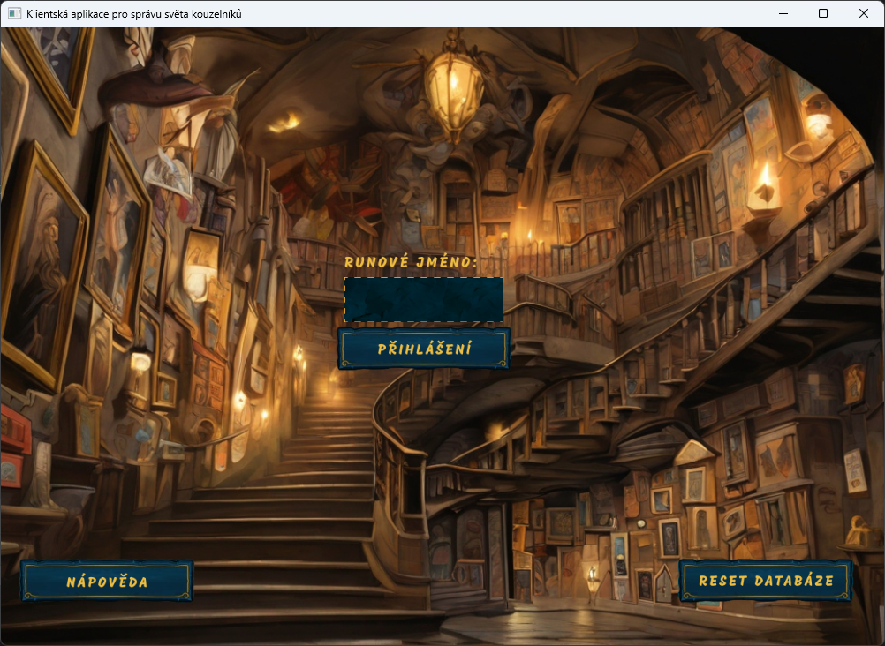
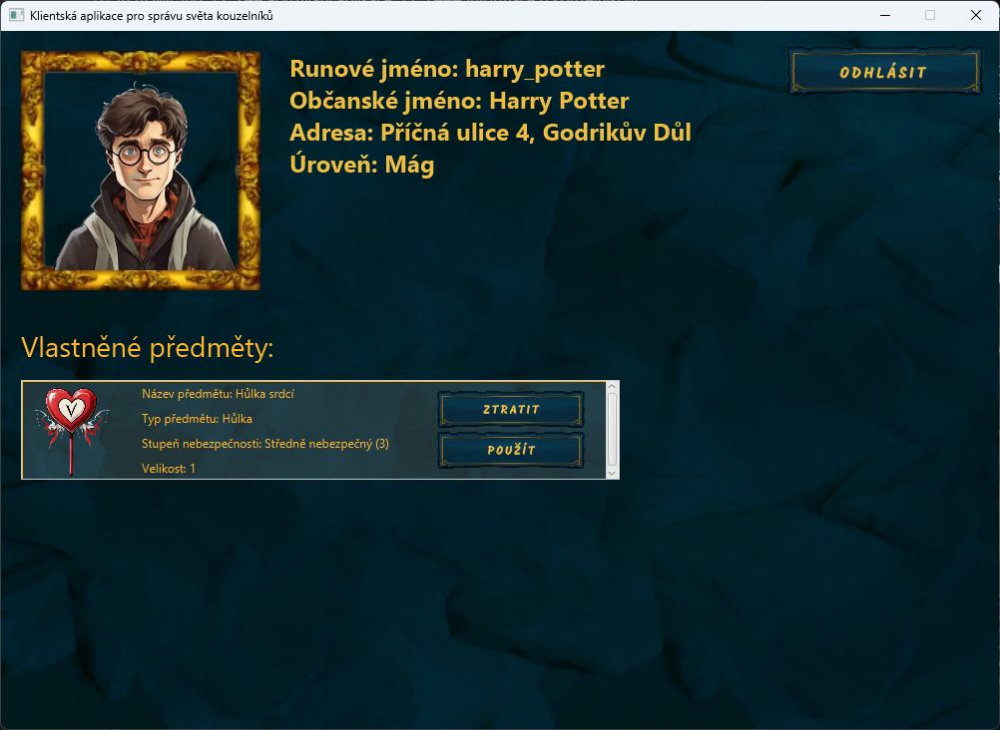
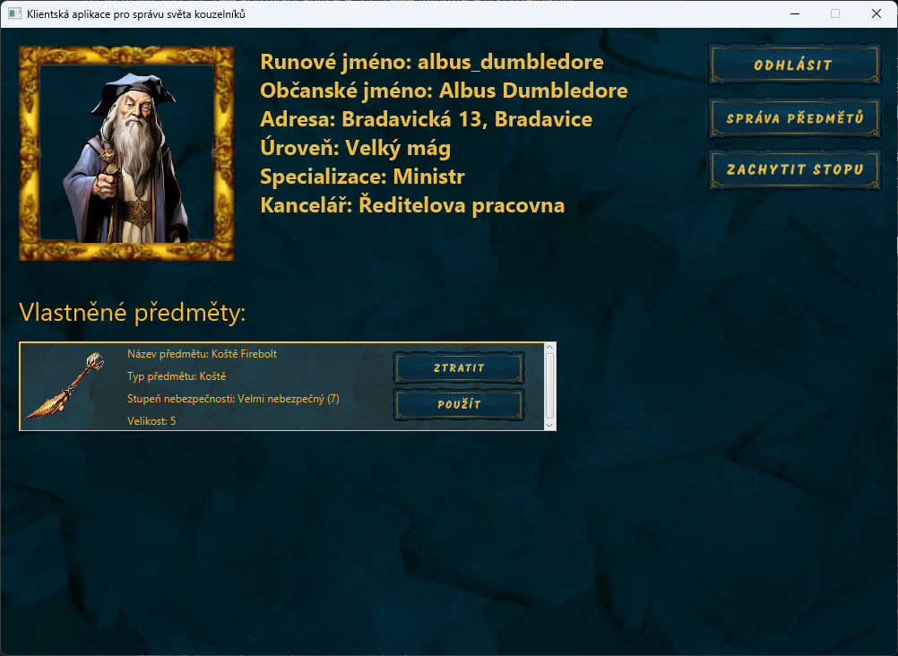
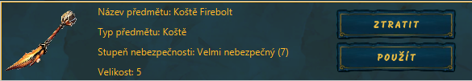
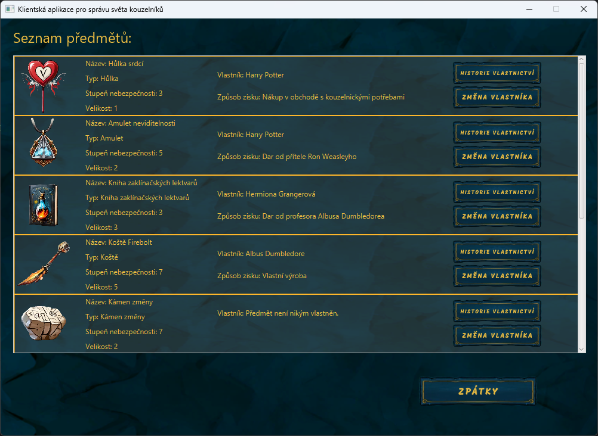
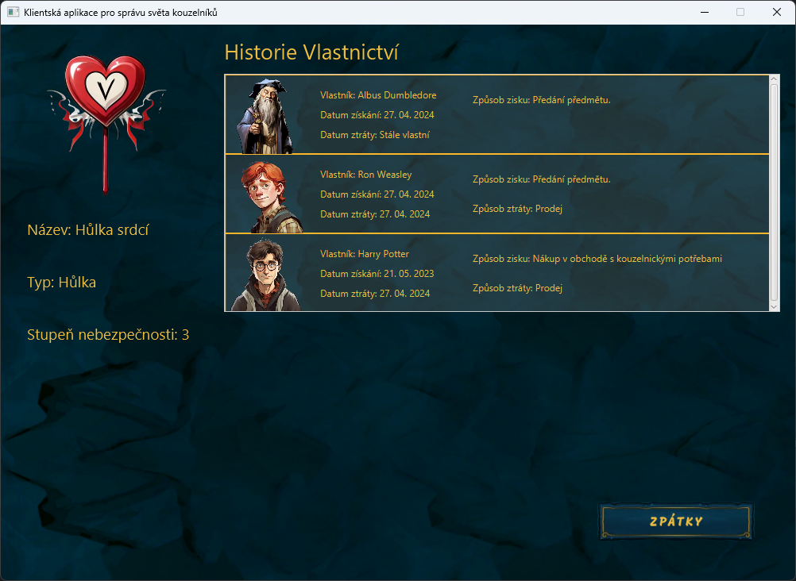
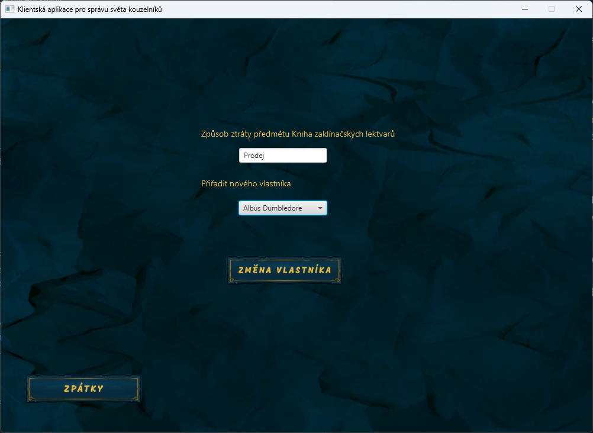

# Klientská aplikace pro správu kouzelníků
*Autor: Tomáš Kučera (xkucer0t)*

Tato klientská aplikace slouží jako databázový systém pro správu kouzelnických předmětů a stop těmito předměty vytvořenými. Veškeré zdrojové soubory jsou umístěny ve složce `src`.

---
## Instalace a prvotní spuštění

Před prvotním spuštěním je nutné si nakonfigurovat připojení k serveru.

Stačí nastavi pomocí příkazu `setx` (na Linuxu pomocí příkazu `export`) tyto proměnné:

|   Název systémové proměnné   |                 Hodnota                 |
|:----------------------------:|:---------------------------------------:|
|    xkucer0t_client_app_URL   | adresa serveru ve formátu `server:port` |
|   xkucer0t_client_app_user   |      uživatelksé jméno (`xlogin00`)     |
| xkucer0t_client_app_password |                  heslo                  |

Nastavení na platformě Windows pro školní server by pak vypadalo takto:

```
setx xkucer0t_client_app_URL gort.fit.vutbr.cz:1521
setx xkucer0t_client_app_user xlogin00
setx xkucer0t_client_app_password password
```

Celou tuto část můžete přeskočit, pokud si chcete aplikaci spouštět sami ze zdrojových kódu. V takovém případě stačí tyto údaje vložit do souboru `DatabaseController.java`, konkrétněji na řádky 42, 43 a 44.


Před spuštěním aplikace je nutné vytvořit na serveru tabulky a vložit do nich data. Obě tyto operace jsou obsaženy ve skriptu `server_start.sql`. Po spuštění tohoto skriptu je aplikace plně připravena k používání, a můžete ji spustit pomocí souboru `IDS_client_app.jar`.

---
## Používání aplikace
Případy užití vychází z diagramu případů užití přiloženého v první části projektu, který je také znározněn zde

<p align="center">
  
</p>

<p align="center">
  <em>Diagram případů užití (Autor: Jaroslav Ištvan (xistva03))</em>
</p>


### Přihlášení
Při spuštění aplikace se otevře přihlašovací okno. Kouzelník se může autorizovat pomocí jeho *runového jména*. Pro usnadnění hledání runových jmen je na obrazovce připraveno tlačítko s nápisem "Nápověda". Po stisknutí tohoto tlačítka se uživateli zobrazí seznam všech runových jmen, kategorizovaný podle specializace ("Kouzelník", "Ministr" nebo "Správce"). Při nasazení aplikace do provozu by bylo vhodné toto tlačítko odstranit. 

Na obrazovce je také tlačíko s nápisem "Reset Databáze", které uvede hodnoty v tabulkách do původního stavu. Toto tlačítko by také bylo vhodné při nasazení odstranit.

<p align="center">
  
</p>

<p align="center">
  <em>Snímek přihlašovací obrazovky</em>
</p>


### Informace o kouzelníkovi
Po úspěšném přihlášení se kouzelníkovi zobrazí jeho informace, včetně vlastněných předmětů.

Pokud je přihlášený kouzelník s hodností ministr, může si prohlédnout všechny předměty včetně jejich vlastníků (pomocí tlačítka "Správa předmětů"), nebo může zachytit stopu. 

<p align="center">
  
   
</p>

<p align="center">
  <em>Přihlášený kouzelník (nalevo) a přihlášený ministr (napravo)</em>
</p>

#### Použití předmětu
Kouzelník může předmět použít, přičemž při použití předmětu se stupněm nebezpečnosti větším než 5 vydává systém automaticky varování. 

#### Dobrovolné vzdání se předmětu
Pokud se kouzelník rozhodne vzdát se vlastněného předmětu, předmět se mu nenávratně odebere z inventáře a zpátky mu ho může přidělit pouze oprávněná osoba (Ministr).

<p align="center">
  
</p>

<p align="center">
  <em>Stručný výpis informací o vlastněném předmětu</em>
</p>


### Správa předmětů
Po kliknutí na tlačítko "Správa předmětů" se ministrům zobrazí seznam všech evidovaných předmětů, včetně základních informací o předmětu, aktuálním vlastníkovi, způsobu zisku a případném způsobu ztráty.

<p align="center">
  
</p>

<p align="center">
  <em>Seznam všech evidovaných předmětů</em>
</p>

### Historie vlastnictví
U každého předmětu si kouzelník může zobrazit celou historii vlastnictví, a to po kliknutí na tlačítko "Historie vlastnictví". Historie obsahuje datum i způsob jak získání, tak i ztráty předmětu konkrétním kouzelníkem. Jednotlivé záznamy jsou seřazeny od nejnovějšího po nejstarší.

<p align="center">
  
</p>

<p align="center">
  <em>Historie předmětu "Hůlka srdcí"</em>
</p>

### Změna vlastníka
Pokud se ministr rozhodne změnit vlastníka u evidovaného předmětu (nebo přidat vlastníka aktuálně nevlastněného předmětu), může tak učinit pomocí tlačítka "Změna vlastníka". Ministr dále vyplní způsob ztráty předmětu a také může rovnou přiřadit nového vlastníka. Aplikace varuje uživatele, pokud má předmět stupeň nebezpečnosti větší než 5 a nový vlastník má kouzelnickou úroveň menší než 5.

<p align="center">
  
</p>

<p align="center">
  <em>Příklad prodeje předmětu a přidělení nového vlastníka</em>
</p>


### Zachycení stopy
Po zakliknutí tlačítka zachytit stopu může ministr vyplnit informace o detekované stopě, konkrétně typ stopy, detektor, kterým byla stopa detekována a runový kód předmětu který stopu vyvolal, pokud je znám.

---

### Ukázka používání aplikace
Zde je video demonstrující používání aplikace.

[Demonstrační video](https://www.stud.fit.vutbr.cz/~xkucer0t/demo.mp4)